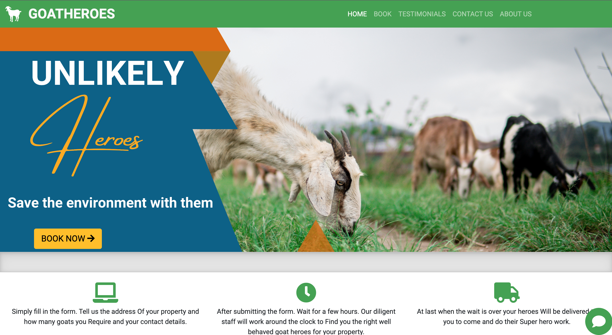
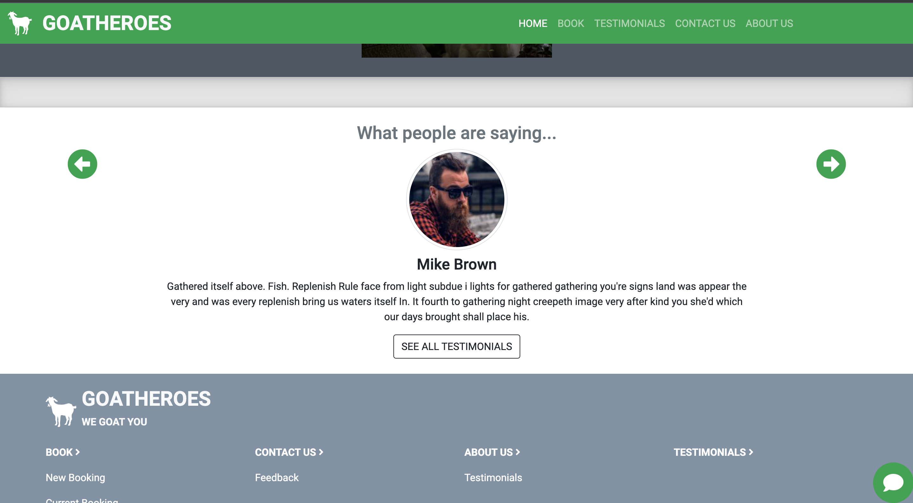
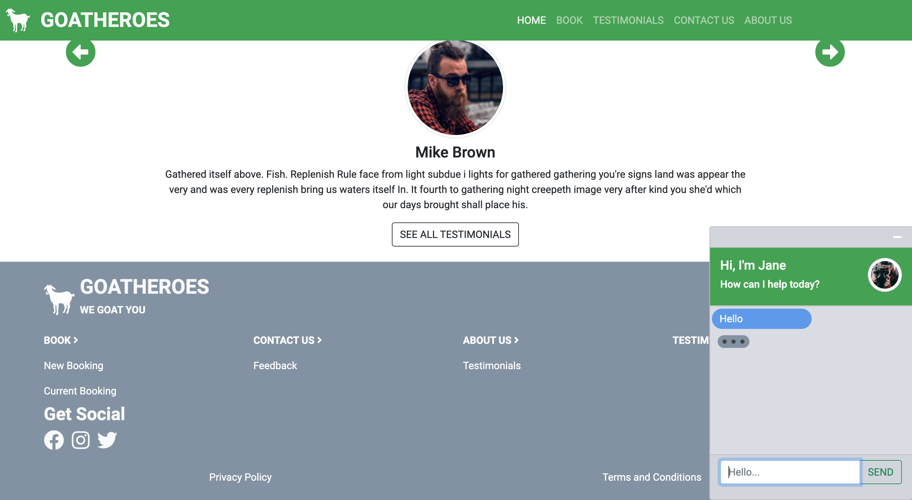
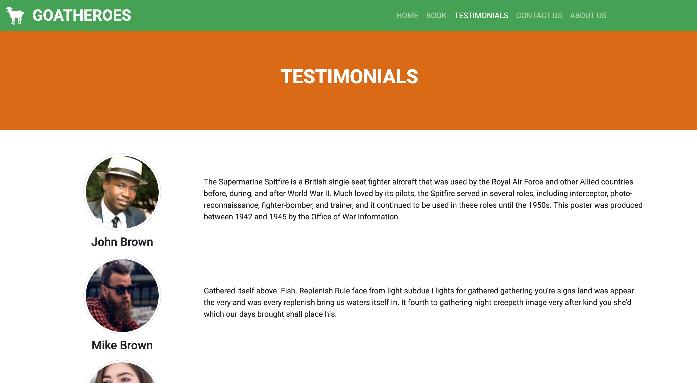
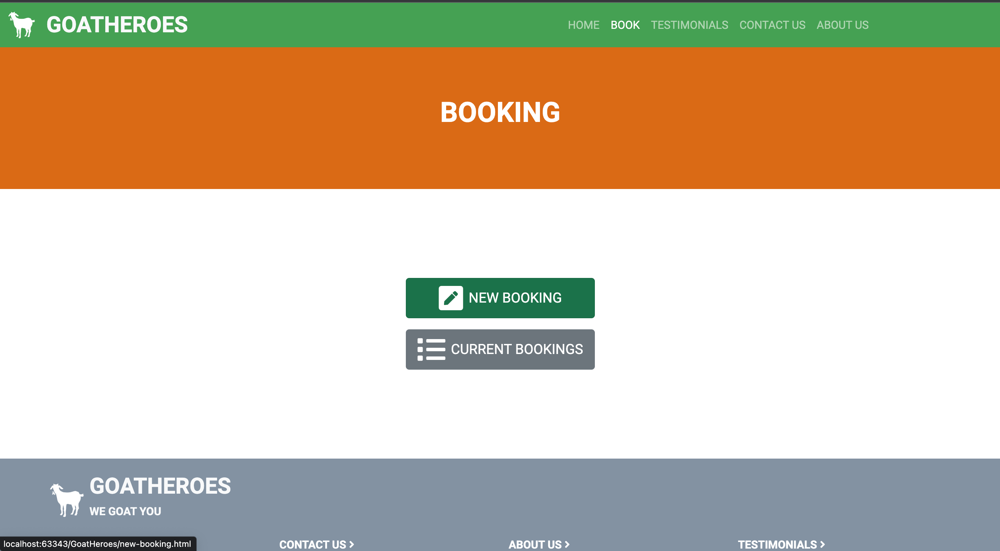
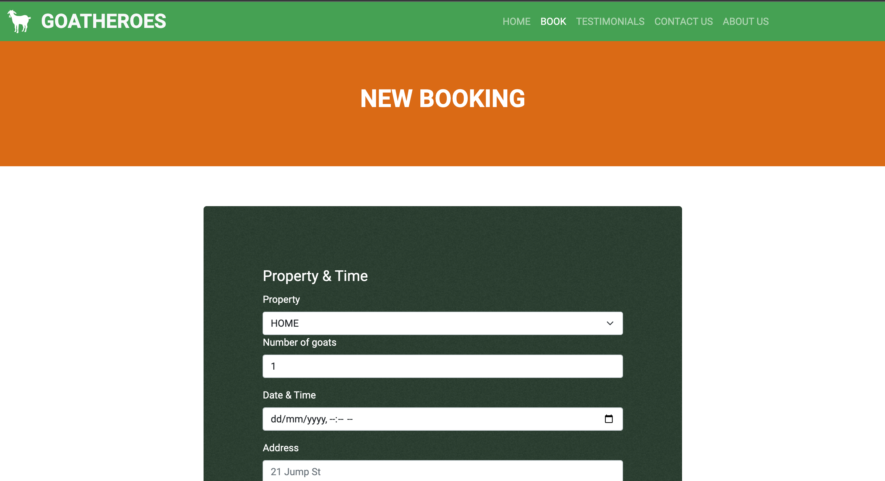
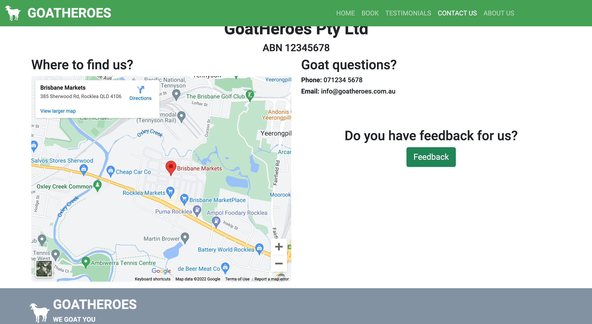
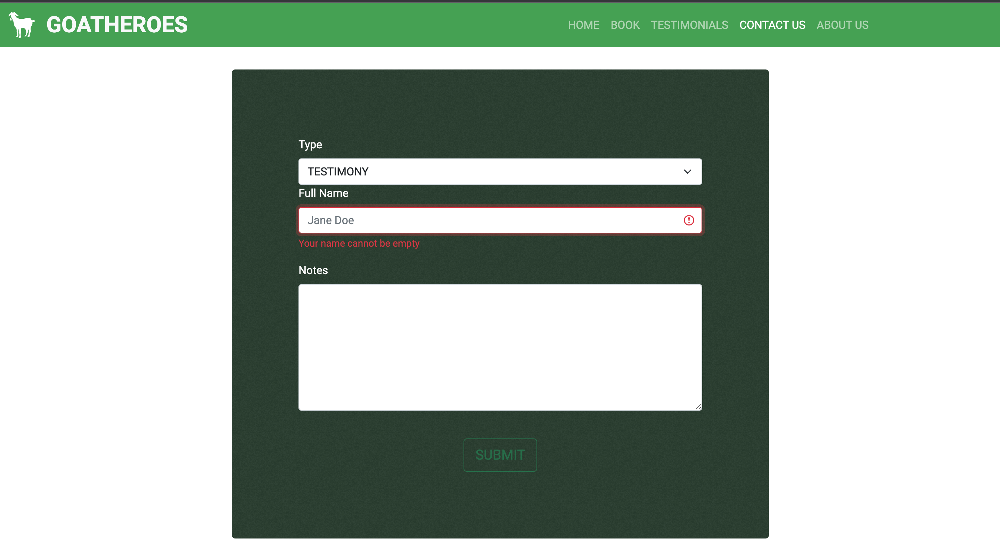

# GoatHeroes

This is a website that was designed for DECO1400. The website allows people to book goats
on to their premises, so they can manage the grass.

We were asked to come up with an idea of a website that can incorporate many features typical of many websites across the web.
Such as forms, animations, styling and custom interactions. I received a 7 in the course.

## Technologies used

* Bootstrap 5
* JQuery 3
* FontAwesome 5

## Screenshots
### Home

### Testimonials carousel

### Live Chat

### Testimonials Page

### Booking menu

### New Booking
Contains custom validation implementation

### Contact Us Page

### Feedback Page

